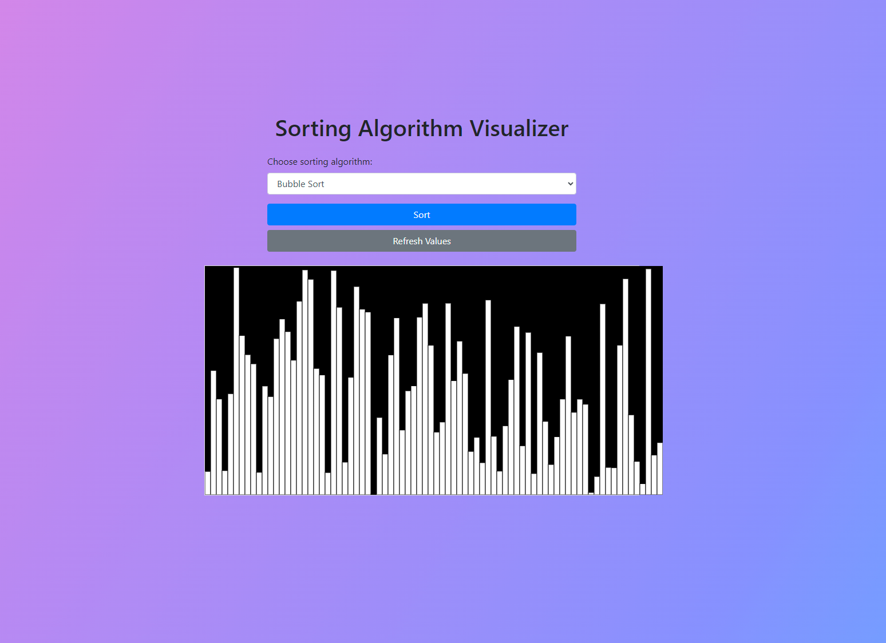

# Sorting Algorithm Visualizer

This project is a web-based tool that visualizes the execution of various sorting algorithms. It helps users understand how different sorting algorithms work by displaying the sorting process step-by-step.

## Features

* Visualizes the following sorting algorithms:
    * Bubble Sort
    * Selection Sort
    * Insertion Sort
    * (Add more algorithms as you implement them)
* Customizable array size and sorting speed.
* Sound effects to accompany the sorting process.
* Interactive controls (Start, Refresh).
* Modern and visually appealing UI using Bootstrap and custom CSS.

## Technologies Used

* HTML5, CSS3, JavaScript
* p5.js library for canvas-based visualizations
* Bootstrap for styling and layout

## How to Use

1. Clone this repository.
2. Open `index.html` in your web browser.
3. Choose a sorting algorithm from the dropdown.
4. Click "Sort" to start the visualization.
5. Click "Refresh Values" to generate a new random array.

## Screenshot

## Contributing

Contributions are welcome! Feel free to open an issue or submit a pull request.

## License

This project is licensed under the [MIT License](LICENSE).
